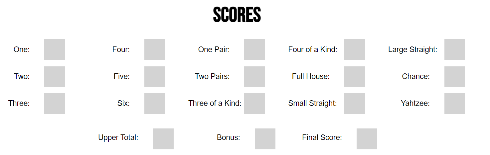
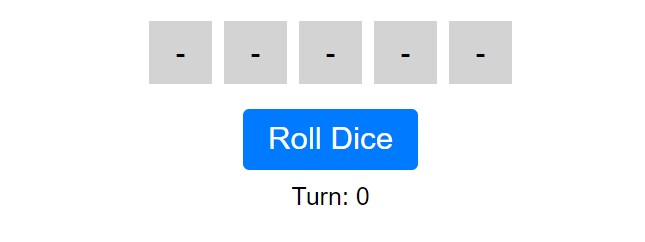
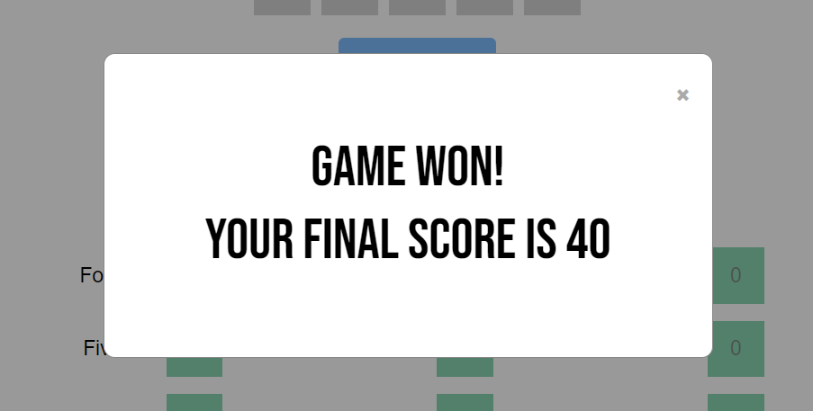

# Design System

This document outlines the design system for the Yatzy project.

## Fonts

### Families

- **Primary Font:** Bebas Neue, sans-serif
- **Secondary Font:** Arial, sans-serif

The Bebas Neue font was use for heading as it is a strong, bold typeface and attracts the attention of users.
The Arial typeface on the other hand was used in the body, as it neutral and does not distract the user.

### Sizes

- **h1:** 60px.
- **h2:** 50px.
- **body:** 20px.

## Colours

- **Primary Colour:** #007bff (Blue)
- **Secondary Colour:** #12AB66 (Green)
- **Accent Colour:** #f33232 (Red)

We opted for blue, green, and red. The blue is was used for the roll button, a primary component of the interface, requiring a visual distinction between it and the background. The green was used for boxes/dice that are selected, providing the user with valid feedback on their inputs. Finally, red was used for the reset button.

## Components

### Header

The header holds the logo with a playful NY Times Games logo.

### Footer

The footer holds the copyright information for the project, delimiting the end of the web page.

### Scoreboard

This component shows all of the combinations possible in a game of Yatzy, informing the player of the current score and final score.

### Play Area

The Play Area shows the 5 dice, as well as a button to roll the dice and the current turn. The dice can be pressed to keep a dice on the board.

### Final Score

The final score modal displays the final score of the Yatzy game.
